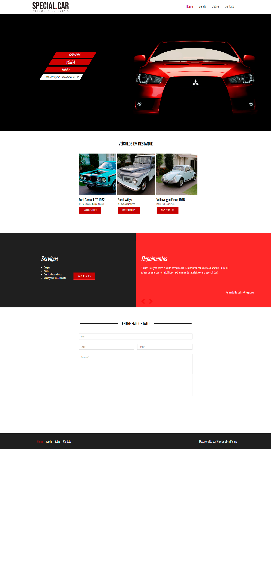
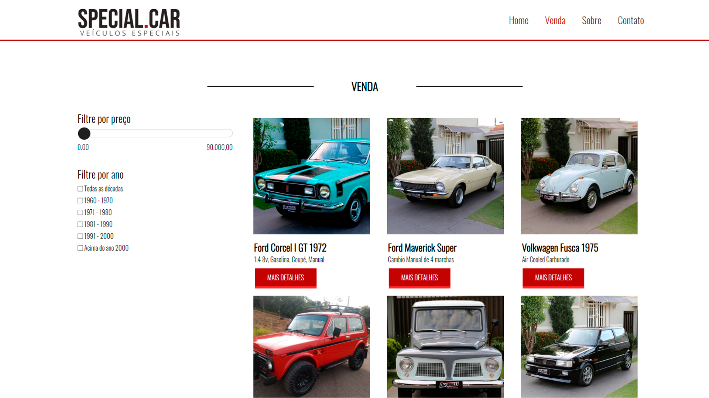
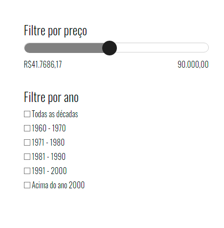
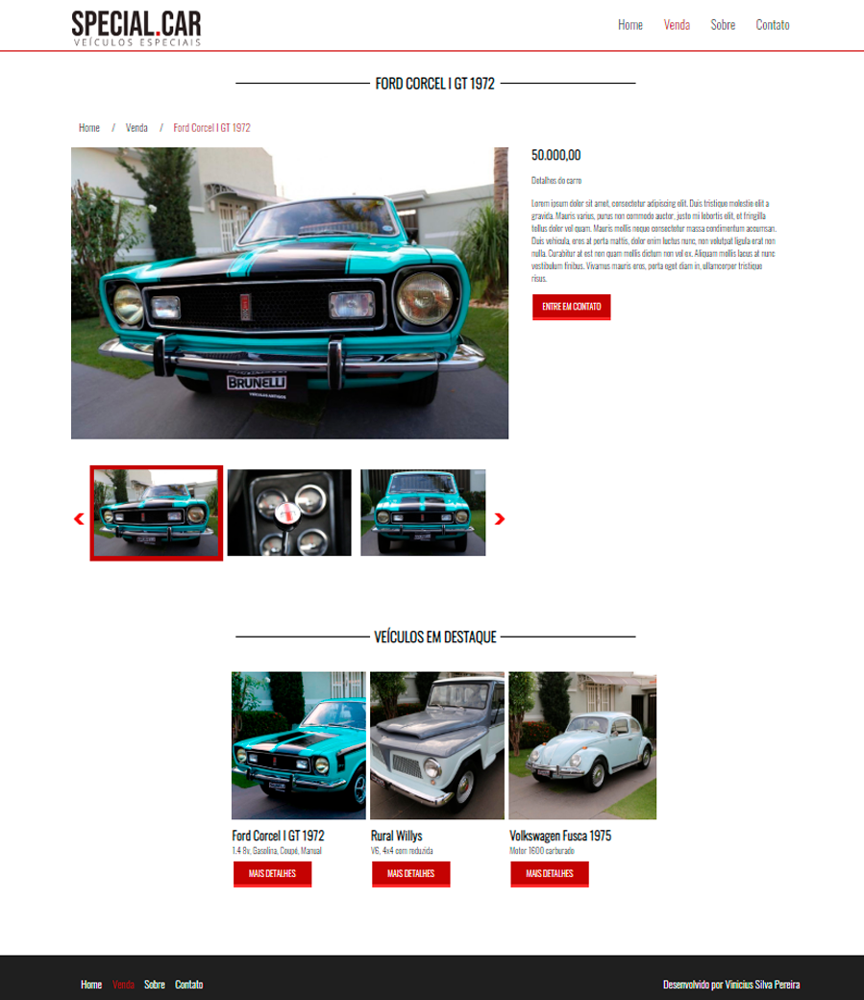
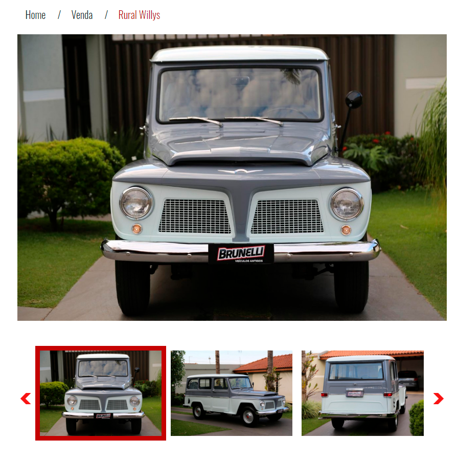
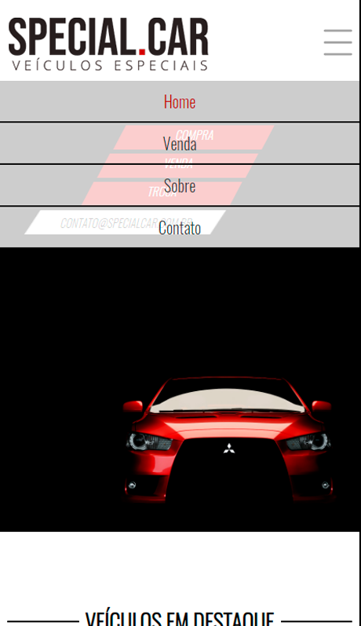

# Special.Car- Veículos Especiais

## Objetivo do Projeto
Página de venda de veículos fantasia criada para implementar conceitos de Front-End para páginas de e-commerce. O objetivo do projeto foi implementar diferentes ações que algumas paginas de vendas online geralmente possuem, tais como filtros de preço através de barra deslizante, sessão de slider fotos do produto que quando clicado destaca a imagem, sessão de depoimentos que mostra depoimentos de compradores, fidelizando a qualidade da empresa responsavel pela venda, agregando valor à pagina. Além disso, o design responsivo se adapta à diferentes viewports automaticamente. Foram implementados scripts em Jquery, bibliota javascript, além de boas praticas de CSS3 responsivo. 

## Desktop Viewport

## Área de Vendas

## Barra para filtrar preço desenvolvida via Jquery
Na área área de vendas foi implementada uma barra para filtrar preços desenvolvida com CSS3 e Jquery. 

## Área de detalhes do veículo escolhido
Esta área apresenta o valor, detalhes e fotos do carro.

## BreadCrumb e Slider de Fotos
Aqui vemos a implementação do BreadCrumb, uq ese trata da arvore de navegação do site, orientando assim o usuário em qual página ele se localiza. Assim como o slider de fotos, que quando clicado, foca a foto no container principal. 

## Mobile Viewport

## Mobile Menu

